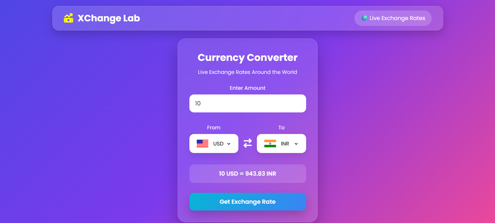

# 💱 Xchange Lab

### A Modern Currency Converter built with HTML, CSS & JavaScript

Convert currencies instantly with live exchange rates through a clean, responsive, and user-friendly interface.

---

## 📖 About

**Xchange Lab** is a responsive web application that allows users to convert currencies using real-time exchange rates. It provides a fast, intuitive, and visually appealing interface, making currency conversion simple and efficient across different devices.

Whether you're a traveler, student, freelancer, or simply checking exchange rates, Xchange Lab delivers quick and accurate conversions with minimal effort.

---

## 🚀 Live Demo

🔗 **Website :** https://xchange-lab.vercel.app/

---

## ✨ Features

* 💱 Real-time currency conversion
* 🌍 Supports multiple international currencies
* 🔄 One-click currency swap
* 📱 Fully responsive design
* ⚡ Fast and lightweight
* 🎨 Modern and clean UI
* 🌐 Live exchange rate integration
* 💻 Cross-browser compatible

---

## 🛠️ Tech Stack

| Technology        | Purpose                     |
| ----------------- | --------------------------- |
| HTML5             | Structure                   |
| CSS3              | Styling & Responsive Design |
| JavaScript (ES6)  | Application Logic           |
| Exchange Rate API | Live Currency Data          |

---

## 📸 Preview :



---

## 📁 Project Structure

```bash
Xchange-Lab/
│
├── index.html
├── style.css
├── script.js
├── codes.js
├── README.md
└── assets/
    └── preview.png
```

---

## 💡 How It Works

1. Enter the amount.
2. Select the source currency.
3. Select the target currency.
4. Click **Convert**.
5. View the converted amount instantly using live exchange rates.

---

## 🎯 Future Enhancements

* ⭐ Favorite currencies
* 📊 Historical exchange rate charts
* 🌙 Dark Mode
* 📈 Exchange rate trends
* 💰 Cryptocurrency support
* 🔍 Currency search functionality
* 📥 Offline caching

---

## 👨‍💻 Author

**Abhijeet Ajit Deokar**

* GitHub : https://github.com/AbhiDeokar75
* LinkedIn : https://www.linkedin.com/in/abhijeet-deokar/

---

## ⭐ Support

If you found this project helpful, consider giving it a **Star ⭐** on GitHub.

It helps others discover the project and motivates future improvements.

---

<div align="center">

### Thank you for visiting ❤️

**Happy Coding ! 🚀**

</div>
